# Infrastructure-Drift-Detection-Auto-Remediation

## Project Overview

This project demonstrates how to detect and automatically remediate infrastructure drift in AWS environments where Infrastructure as Code (IaC) is enforced using Terraform.

In real-world scenarios, engineers sometimes make manual changes via AWS Console, leading to configuration drift. This project solves that problem by implementing:

Drift detection mechanism

Automated remediation using AWS Lambda

Logging via Amazon CloudWatch

 # step 1: 
1. Infrastructure Provisioning Using Terraform

created instance
security group 
s3 bucket

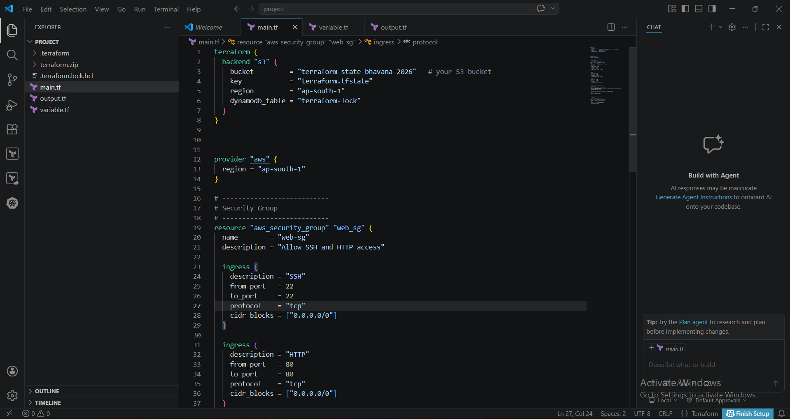

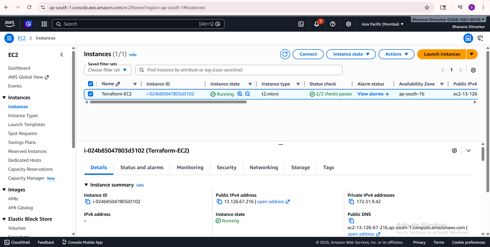

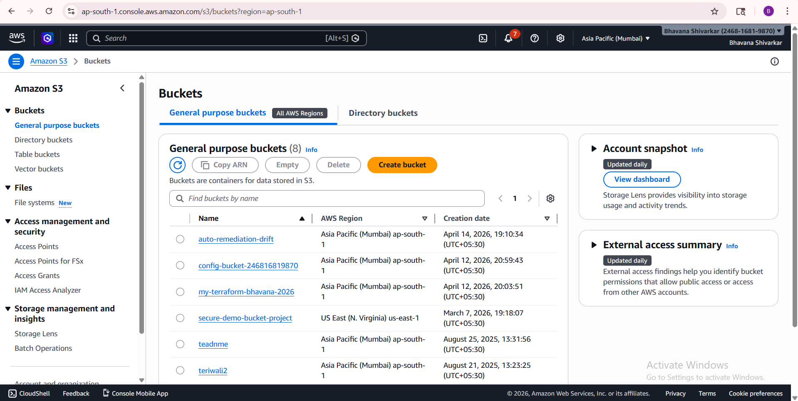

 # step 2 :
2. Simulate Drift
Manually modify:
Security group rule
EC2 tag
 
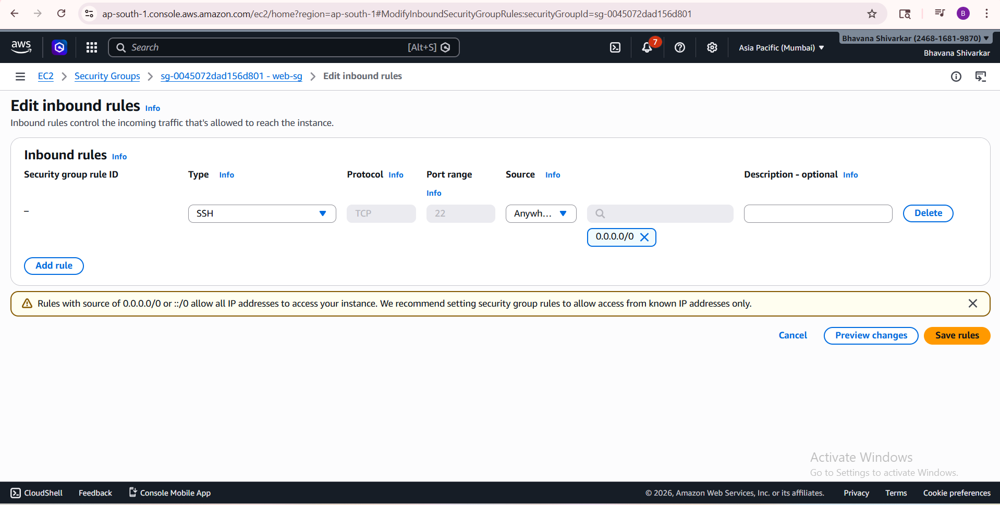

 # step 3:

3. Drift Detection
Implement:
 	Scheduled Terraform plan

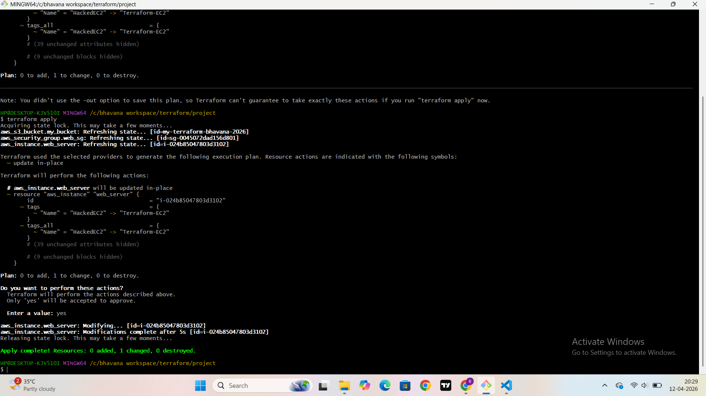

# step 4:

4. Auto Remediation
Create Lambda function that:
Detects drift
Re-applies Terraform

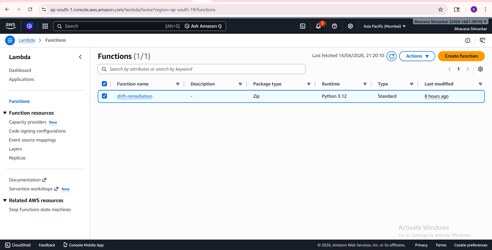

attached i am role to lambda function

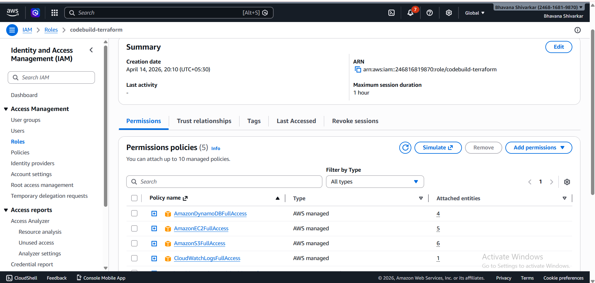

uploded lambda-package.zip file in lambda function

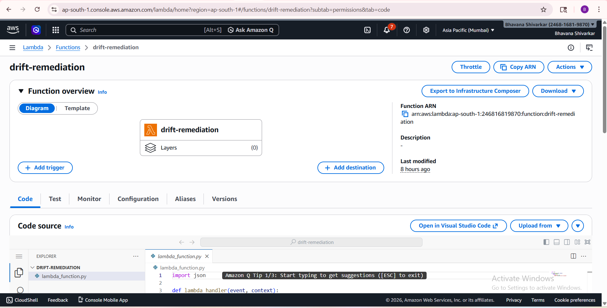

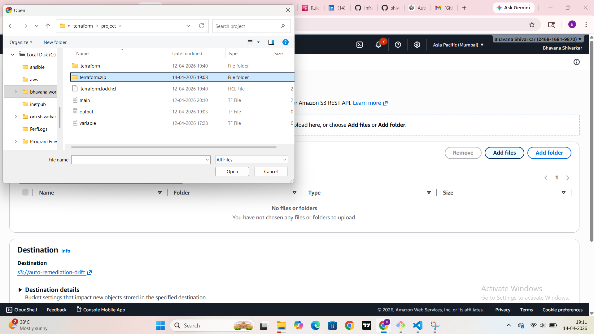

## eventbridge setup

### How It Works
EventBridge runs on a fixed schedule (cron or rate)
It triggers the Lambda function
Lambda executes:
terraform init
terraform plan
If drift detected → terraform apply
Logs are stored in CloudWatch Logs

### Rule Configuration
Rule Name: terraform-drift-auto-fix
Event Bus: default
Type: Scheduled Rule
Target: Lambda Function (terraform-drift-remediation)
Status: Enabled

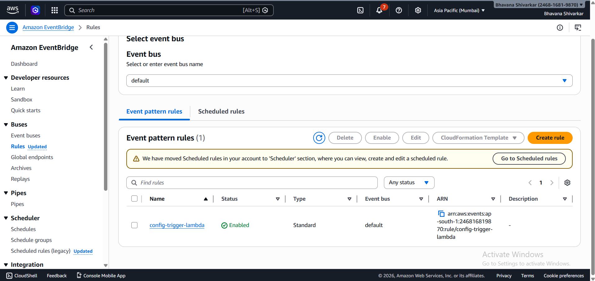

##  Architecture Flow

EventBridge (Schedule)
        ↓
Lambda Function
        ↓
Terraform (init → plan → apply)
        ↓
AWS Infrastructure (EC2, S3, SG, etc.)
        ↓
CloudWatch Logs

## project output:

manually changed on aws console

changed security group rule
deleted ssh
added 80

changed instance name with my-ec2

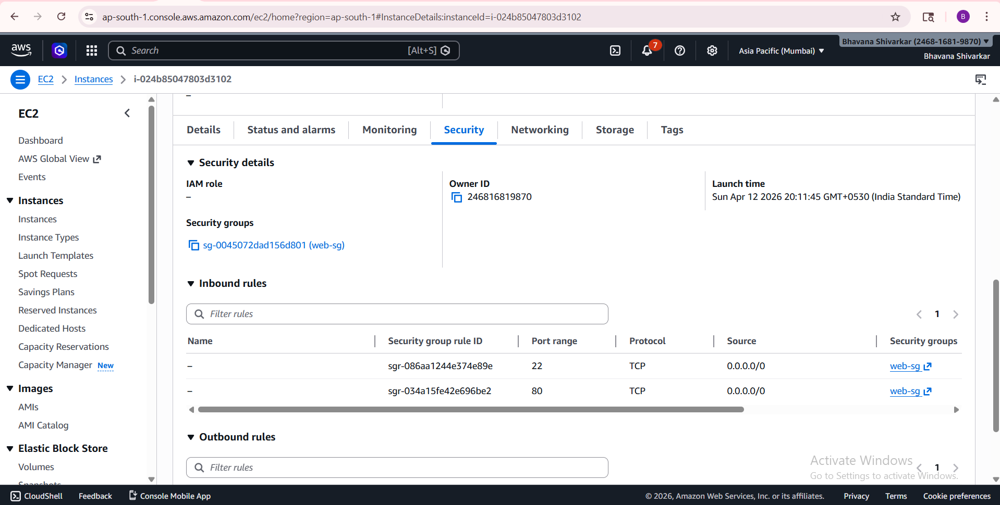

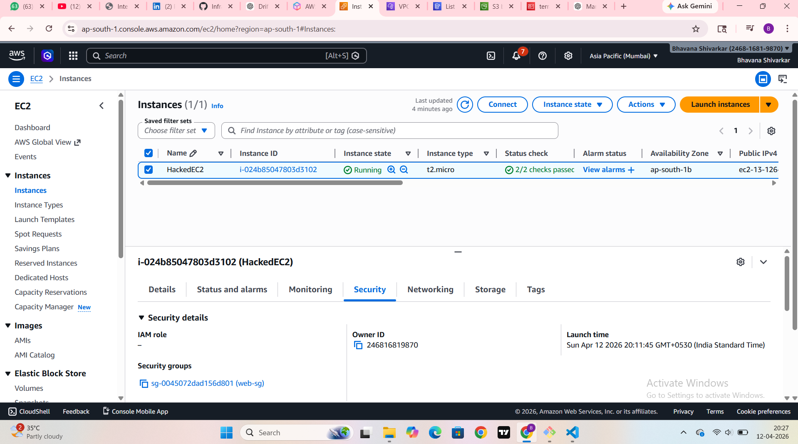

If we manually change something in the AWS Console:

 Terraform detects it as drift

Your actual AWS resources no longer match your Terraform code

 What your system does next:

 #### Amazon EventBridge triggers your Lambda automatically

   AWS Lambda runs terraform plan

   Drift is detected

   Lambda runs terraform apply to fix it

 Final result:

Your infrastructure is restored back to the original Terraform configuration ✅

 # step 5:

5. Logging
Store events in:
CloudWatch Logs 

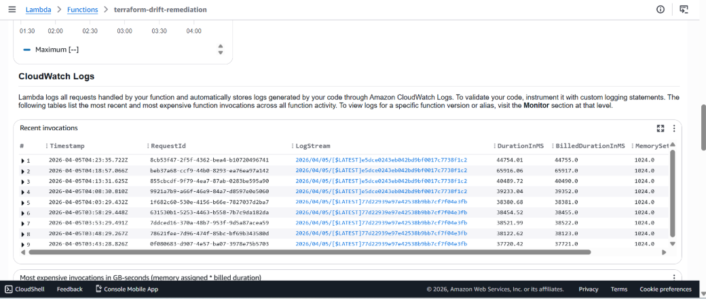

### Conclusion

This project builds a self-healing infrastructure system using Terraform and AWS services like AWS Lambda and Amazon EventBridge. It automatically detects and fixes infrastructure drift, ensuring consistency, reducing manual effort, and improving reliability of cloud resources. 

